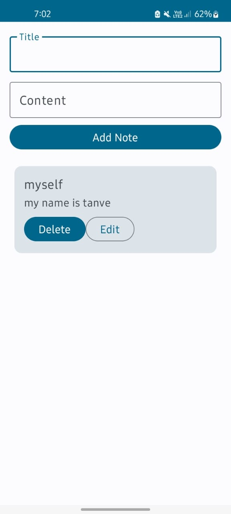
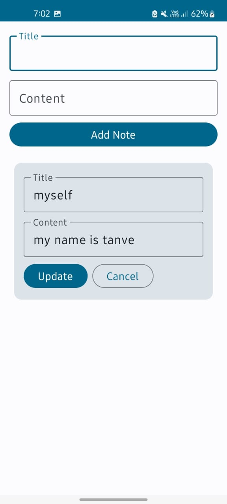

# CrudWithRoom

A simple *CRUD (Create, Read, Update, Delete)* note-taking Android app built using *Jetpack Compose*
and *Room Database*. This app demonstrates how to build reactive UIs with Compose and persist
data using Room.

---

## 📱 Features

- ✅ Add new notes
- 📝 Edit/update existing notes
- 🗑 Delete notes
- 📄 View all saved notes
- ⚡ Real-time UI updates using mutableStateListOf and Compose state management

---

## 🧰 Tech Stack

- 🔹 Kotlin
- 🔹 Jetpack Compose (UI)
- 🔹 Room Database (Data Persistence)
- 🔹 ViewModel + State management
- 🔹 Material3 for UI Components

---

## 📸 Screenshots

| UI Screen                  | Edit Click                   | 
|----------------------------|------------------------------|
|  |  |

---